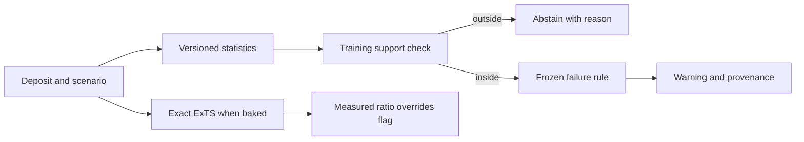

# Deposit-statistics live guard: design

Status: proposed. [Requirements](requirements.md) and [tasks](tasks.md).

## Data flow

The statistical features are computed from fields both synthetic and MineLib
input instances carry. Candidate features include pit fraction, ore-to-waste
tonnage, grade concentration by quantile, positive-value spatial concentration,
and precedence density, plus the declared rate/capacity/horizon. Geometry
features need stable units and missing-value behavior. They live in a new
versioned `guard_feature_vector`; changing the existing bound-surrogate
`deposit_feature_vector` would silently invalidate its trained weights.

`train_learned.py` or a dedicated local research script computes labels using
the exact ExTS and learned schedule on the same generated case. All scenarios
of a seed stay together. The existing train seeds fit transforms and select a
simple interpretable rule. The held-out seeds can reject it, but never tune it.
The third seeds remain untouched until a single frozen candidate is evaluated.
The validator must fail if a post-selection rerun changes the rule or split.

The exported rule is small JSON: feature schema/version, train extrema or
calibrated support region, coefficients/cuts, failure threshold, split hashes,
and measured held-out/third-split metrics. The browser reads the same record;
it does not retrain. When the exact comparison is in the trace, the measured
ratio has precedence over any warning. On out-of-support real cases the UI
says why the guard cannot speak. The validator records abstention counts and
the worst missed case, not only recall.

The baseline is the current label rule's **clean** 216-case result, not its
flattering holdout result. G-04 is a predeclared minimum; if it fails, publish
the negative measurement in `docs/methods/10_when_the_surrogate_fails.md` and
leave the live lane unguarded. No test may redefine failure after seeing the
third split.
