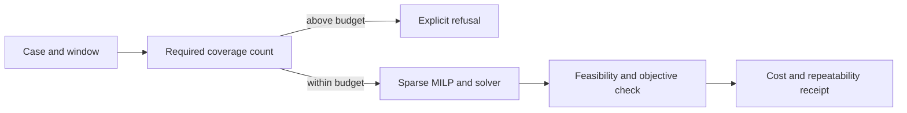

# Sliding-window scale: design

Status: proposed. [Requirements](requirements.md) and [tasks](tasks.md).

The current `oreblocks.sliding_window_schedule` builds a joint MILP for a
three-period window plus one optimistic tail, freezes one period per slide,
and refuses when `cand_max` is too small to cover the resource limit. In
PhaseFlow the fixed `1,500` candidate budget excludes twelve of thirteen
cases. The first controlled pilot raises the budget only for the two 6,912
block controls, without changing the mathematical model or declaring success
from a mere nonempty schedule.

The pilot should instrument the sparse matrix and solver output, compare the
same case to the current `toposort-expected` and `cpitD-local-search` rows, and
repeat once with identical settings. If the first larger case exceeds 10
minutes or 4 GiB, the next task is a formulation/profile investigation in
`oreblocks`, not a larger unbounded `cand_max`. The release budget applies to
each case so the full bake cannot grow without control. A timed-out or
uncertified MIP result is labeled as such; no `exact` claim is inferred from a
feasible incumbent.

The emitted trace records candidate count, model size, cost and status with
the method row. The UI reads these fields and displays skip reasons in the
Methods tab. The entire thirteen-case bake remains one atomic release action;
a single-case pilot stays under ignored `build/`.
