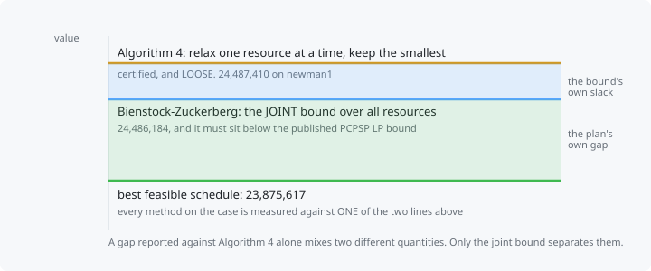

# The bound



The constrained pit limit problem is NP-hard, so PhaseFlow does not claim an optimum. It computes a
**certified upper bound** and reports every schedule's distance from it. A schedule shown without its
gap is a number with no scale.

Two bounds are computed, and which one is used matters.

## 1. The critical multiplier algorithm: exact, and with no LP solver

Chicoisne, Espinoza, Goycoolea, Moreno and Rubio, Operations Research 60(3):517-528, 2012,
[doi:10.1287/opre.1120.1050](https://doi.org/10.1287/opre.1120.1050), **Theorem 3.1**: for CPIT with a
single resource constraint per period, the LP relaxation is solved **exactly** in `O(mn log n)`.

Three steps, each worth understanding because the whole product rests on them.

**Abel summation.** The objective is stated over the increments `x_t - x_{t-1}`, but it rewrites as a
positively weighted sum over the CUMULATIVE pits:

```
sum_t d_t (x_t - x_{t-1}) . p  =  sum_t gamma_t (x_t . p)
gamma_t = d_t - d_{t+1} > 0,   gamma_T = d_T
```

Every weight is positive. That is the pivot: maximising the whole is maximising each term separately.

**Cumulative capacity.** Relaxing the per-period capacities into their cumulative form
`U_t = sum_{s<=t} c_s` decouples the periods into `T` independent problems:

```
CP(U_t) = max p.x    s.t.  x closed,  a.x <= U_t,  0 <= x <= 1
```

**Parametric nested pits.** Each `CP(U)` is attained by a convex combination of two consecutive
solutions of `UPL(p - lambda a)`. Those are nested pits, which are maximum closures, which are minimum
cuts. With `b^u >= U >= b^l` the bracketing capacities:

```
alpha = (b^u - U) / (b^u - b^l)
x     = alpha x^l + (1 - alpha) x^u          and    a.x = U
```

The solution turns out to be feasible for CPIT itself (it saturates each period exactly), so the
relaxation is tight and the value is the LP optimum.

### The stopping rule is a certificate, not a tolerance

Strong duality gives `CP(U) = min_lambda [ UPL(p - lambda a) + lambda U ]`. The search refines until
the primal estimate and that dual expression agree. When they do, the two bracketing pits are
**provably** consecutive break-points.

An earlier version stopped when the lambda interval was narrow. That proves nothing: a narrow interval
can still straddle an unexplored break-point, and the duality assertion caught it doing so. The lesson
generalises and is why it is written down here: **a tolerance on an input is not evidence about an
output.**

### Performance, measured

The break-points do not depend on the period, only the target capacity does, so they are solved lazily
into a cache shared across periods, and each new solve is restricted to the smallest known pit that
must contain it.

| instance | closure solves before | after | time |
|---|---|---|---|
| published `newman1.cpit` | 91, 89 | 34, 45 | 5.4 s to 1.3 s |
| 6912-block twin, two resources | 347, 337 | 129, 73 | 36 s to 11.7 s |

Identical bounds and identical schedules throughout: this was a cost reduction, not a change of
answer, and the tests assert that.

## 2. Algorithm 4: what happens with two resources

The critical multiplier algorithm needs ONE resource constraint per period. Real instances have two, a
mining capacity and a processing capacity. Algorithm 4 of the same paper relaxes all but one, solves,
and keeps the smallest of the resulting bounds. Every one of them is a valid upper bound on the
two-constraint optimum, so the minimum is **certified**.

It is also **loose**, and that matters more than it sounds. A reported gap then mixes two different
things, how much the heuristic loses and how much the bound loses, and no amount of staring at the
number separates them.

## 3. Bienstock-Zuckerberg: the joint bound

Bienstock and Zuckerberg, IPCO 2010,
[doi:10.1007/978-3-642-13036-6_1](https://doi.org/10.1007/978-3-642-13036-6_1); the implementable
version is Munoz, Espinoza, Goycoolea, Moreno, Queyranne and Rivera Letelier,
[doi:10.1007/s10589-017-9946-1](https://doi.org/10.1007/s10589-017-9946-1), which recasts it as column
generation and is what this implementation follows.

The problem is written as a **General Precedence Constrained Problem**:

```
max c'z   s.t.   z_i <= z_j  (precedence),   Hz <= h  (side constraints),   z in {0,1}^n
```

CPIT becomes one by TIME-EXPANDING: node `(b, t)` is the cumulative variable `x_bt`, precedence arcs
repeat in every period, monotonicity adds `x_bt <= x_b,t+1`, and each capacity row carries a POSITIVE
coefficient on `(b, t)` and a NEGATIVE one on `(b, t-1)`. Side rows with negative entries are exactly
why this needs BZ rather than a second parametric closure.

The restricted master runs over the **linear** hull of the precedence polytope, not the convex hull
that Dantzig-Wolfe uses (and that is why DW converges slowly here), and its generator columns are
**orthogonal 0-1 vectors**. Restricting to their span EQUATES the variables inside each support, which
contracts the problem: rows and variables collapse while the structure survives. The pricing problem is
`max (c - pi'H)'v` over closures, which is a maximum closure, which is a minimum cut, so the whole
algorithm rides on the same max-flow this product already ships.

The refining step, from the paper: given incumbent columns `v^1..v^r` and a new pricing solution `v`,
the next matrix is the non-zero vectors of

```
{v^j AND v}  union  {v^j MINUS v}  union  {v MINUS (union_j v^j)}
```

which yields at most `2r + 1` columns and keeps them orthogonal.

### What it is worth, and what it is not

**It is not a tighter bound than the LP.** `Z_BZ = Z_LP` is proven, because `{z : z_i <= z_j}` is
totally unimodular. Anyone claiming BZ produces a better bound than the LP relaxation is wrong.

What it gives is the **joint** bound over all resources at once, which Algorithm 4 cannot, and speed at
a scale where a general LP solver produces nothing. Measured by its own authors on `zuck_medium`:
40 seconds against 954,405 seconds for CPLEX 12.6, and CPLEX solved only the five smallest of fifteen
instances at all.

Measured here on the published `newman1.cpit`:

| bound | value | work | time |
|---|---|---|---|
| Algorithm 4 | 24,487,410 | 79 closures | 1.3 s |
| **Bienstock-Zuckerberg** | **24,486,184** | 9 iterations | 1.9 s |
| published (PCPSP LP) | 24,486,549 | | |

The ordering is the check. The CPIT LP bound must sit BELOW the PCPSP LP bound, because PCPSP is the
richer problem, and it does. And on a single-resource instance BZ and the critical multiplier algorithm
agree to **machine precision**, which is two entirely different algorithms computing the same LP and
the strongest correctness evidence in the repository.

### Where it does not run, and why that is stated rather than hidden

Every BZ iteration is one maximum closure over the time-expanded graph, and this max-flow is pure
Python. The budget is measured, not guessed:

| instance | time-expanded nodes | edges | BZ |
|---|---|---|---|
| `newman1`, 6 periods | 6,360 | 28,832 | converges in 1.9 s |
| 6912-block twin, 8 periods | 55,296 | 479,000 | above budget |

Where the budget is exceeded, the bound report says so in words and Algorithm 4's certified but looser
bound is used for every gap on that case. A blank field would have been the dishonest option, and an
un-noted silent fallback would have been worse.

## The gap

```
gap = (bound - npv) / bound
```

which is the definition MineLib results are published under (Jelvez, Morales and Nancel-Penard,
[doi:10.1007/978-3-319-99220-4_18](https://doi.org/10.1007/978-3-319-99220-4_18), equation 12). The App
shows both bounds and names which one it used, so the reader can see how much of a gap belongs to the
plan and how much belongs to the yardstick.
